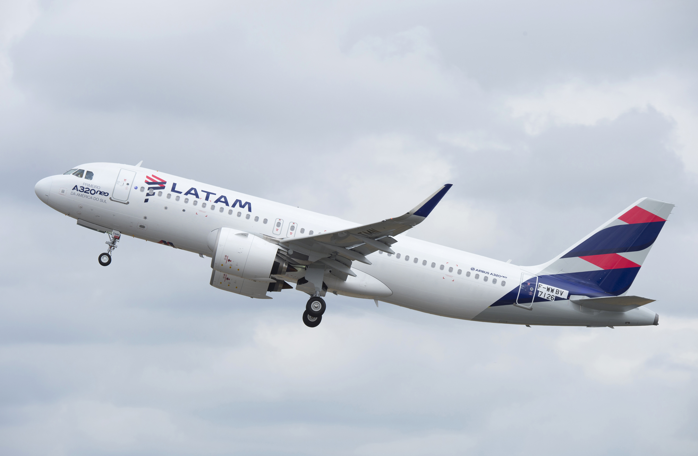
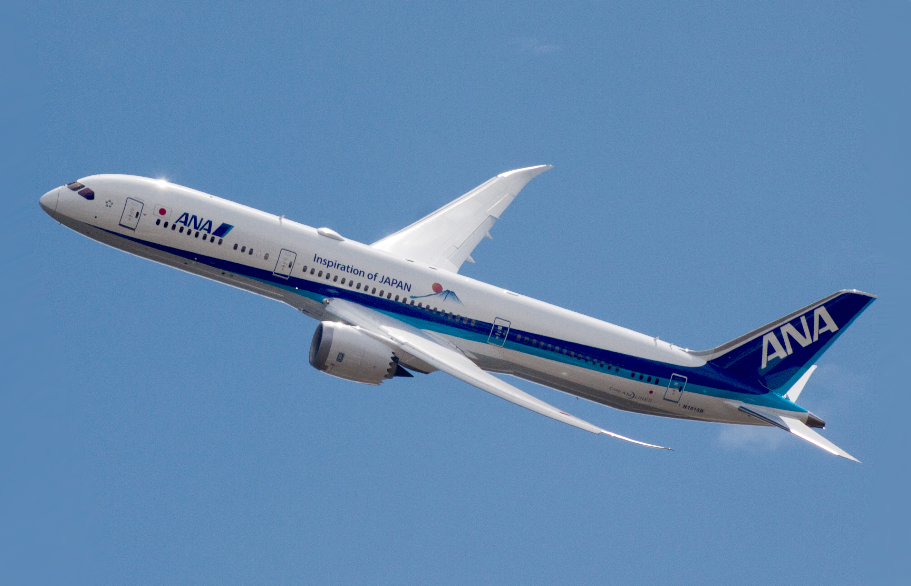
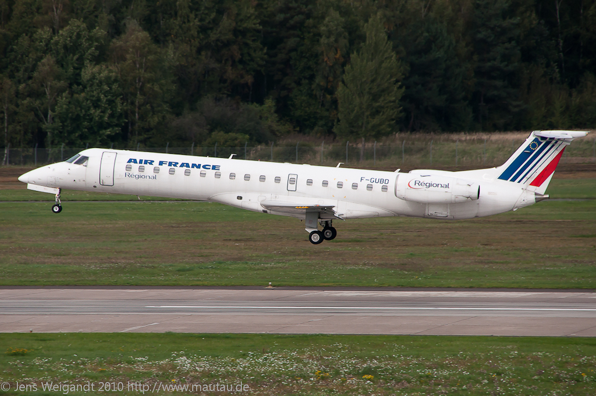
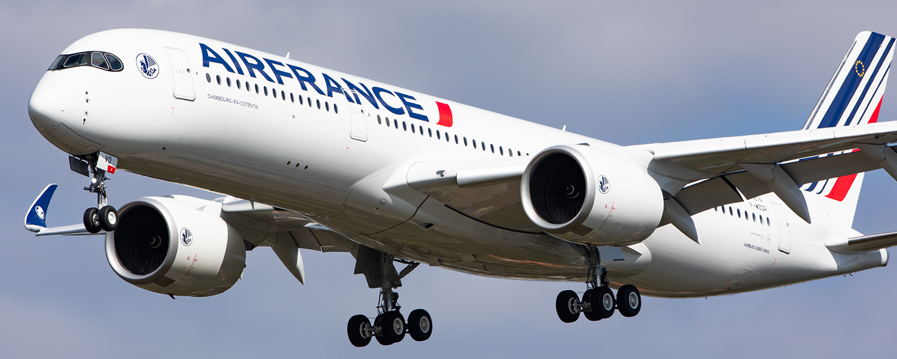

# Ficha Técnica: Aviões comerciais

## Comparativo de Características

### Boeing 737 MAX 8

| Característica | Valor |
|----------------|-------|
| **Frabricante** | [Boeing](https://www.boeing.com) |
| **Capacidade** | 162 passageiros (em 2 classes) |
| **Alcance** | ~6.704 km |
| **Velocidade de Cruzeiro** | 839 km/h (Mach 0.79) |
| **Comprimento** | 39.47 m |
| **Envergadura** | 35,9 m |
| **Altura** | 12.3 m |

**Principais vantagens**
- Eficiência de combustível
- Tecnologia avançada
- Baixo custo operacional

---

### Airbus A320neo

| Característica | Valor |
|----------------|-------|
| **Fabricante** | [Airbus](https://www.airbus.com) |
| **Capacidade** | 165 passageiros (duas classes) |
| **Alcance** | 6,500 km |
| **Velocidade de Cruzeiro** | 828 km/h (Mach 0.78) |
| **Comprimento** | 37,57 m |
| **Envergadura** | 35,8 m |
| **Altura** | 11,76 m |

**Principais vantagens:**
- Cabine mais larga
- Melhor conforto para os passageiros
- Tecnologia fly-by-wire

---

### Boeing 787 Dreamliner

| Característica | Valor |
|----------------|-------|
| **Fabricante** | [Boeing](https://www.boeing.com) |
| **Capacidade** | 	296 passageiros |
| **Alcance** | 14.01 km |
| **Velocidade de Cruzeiro** | 920 km/h (~Mach 0.745) |
| **Comprimento** | 62,8 m |
| **Envergadura** | 60,1 m |
| **Altura** | 16,3 m |

**Principais vantagens:**
- Material composto (50% carbono)
- Janelas maiores
- Pressurização melhorada

---

### ERJ 145

| Características | Valor |
|-----------------|-------|
| **Frabicante** | [Embraer](https://www.embraer.com) |
| **Capacidae** | 50 passageiros (classe única) |
| **Alcance** | 3 706 km |
| **Velocidade de Cruzeiro** | 750 km/h |
| **Comprimento** | 29,87 m |
| **Envergadura** | 20,04 m |
| **Altura** | 6,75 m |

**Principais Vantagens:** 
- Excelente preformance regional
- Opera bem em aeroportos de menor infraestrutura
- Operação barata

---

### A350-900

| Características | Valor |
|-----------------|-------|
| **Fabricante** | [Airbus](https://www.airbus.com) |
| **Capacidae** |
| **Alcance** |
| **Velocidade de Cruzeiro** |
| **Comprimento** |
| **Envergadura** |
| **Altura** |

## Comparativo Geral 

Modelo | Capacidade | Alcance | Velocidade | Eficiência |
-------|------------|---------|------------|------------|
 **737 MAX 8** | 

## Conclusão 

Cada avião tem suas **especialidades**:
- **737 MAX 8**: Ideal para rotas domésticas
